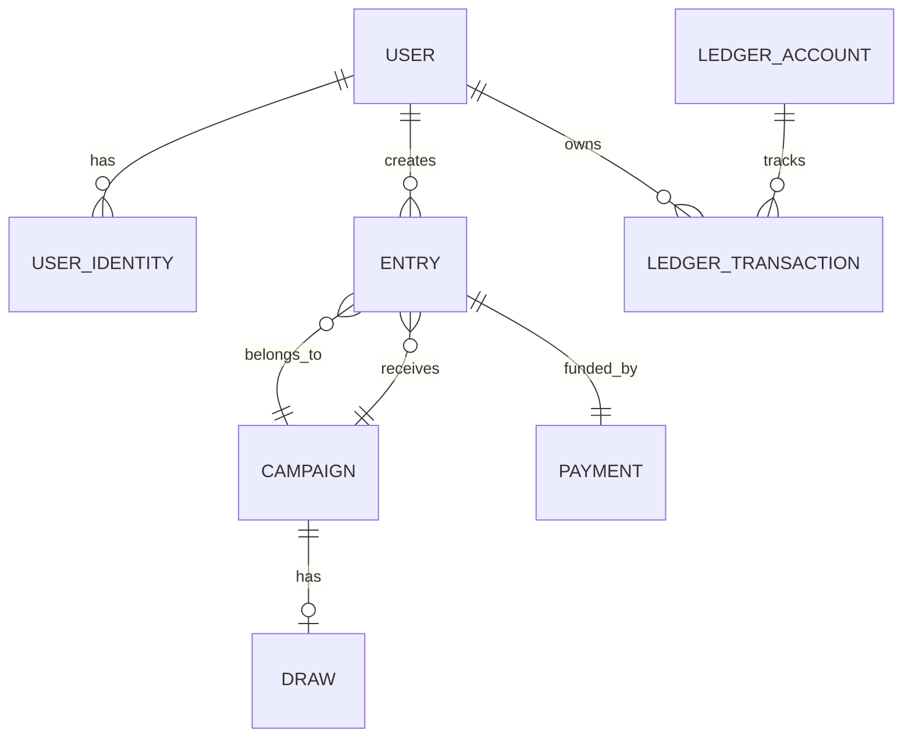

# Database Architecture

## 1. Entity Relationship Diagram

## 2. Core Tables (Draft Schema)

### Users & Identities
- `users`: Core identity (id, email, phone, role, created_at)
- `user_identities`: Linked accounts (user_id, provider: 'telegram'|'email', provider_id, linked_at)

### Campaigns
- `campaigns`: (id, title, description, entry_price, currency, max_entries, starts_at, ends_at, status: DRAFT|ACTIVE|CLOSED|DRAWING|COMPLETED)
- `prizes`: (id, campaign_id, title, value, type)

### Entries & Ledger
- `entries`: Immutable tickets (id, campaign_id, user_id, payment_id, entry_number, status)
- `ledger_accounts`: Financial balance state per user
- `ledger_transactions`: Immutable log of value movement (id, account_id, amount, currency, reference_type, reference_id)

### Payments
- `payments`: User purchase attempts (id, user_id, amount, status: PENDING|APPROVED|REJECTED, screenshot_url, transaction_id, provider)

### Draws
- `draws`: Immutable record of the winner selection (id, campaign_id, snapshot_hash, random_seed, winning_entry_id, status)

## 3. Concurrency Strategy
- **Entry Generation:** Uses DB-level transaction to check `COUNT(entries) < max_entries` AND `pg_try_advisory_xact_lock` on the campaign ID before inserting.
- **Ledger:** Strict immutable append-only inserts. Balances are calculated by summing transactions, or via a strongly consistent trigger/materialized view.
