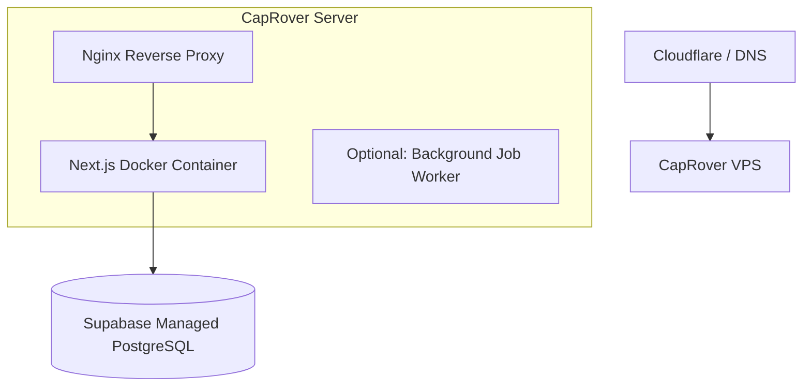

# Deployment Architecture

## 1. Target Infrastructure
The application will be deployed on the existing **CapRover VPS**.



## 2. CapRover Configuration
The existing `captain-definition` and `Dockerfile` will be reused.
Next.js will be built in standalone mode for optimized Docker images.

## 3. Environment Variables
To deploy successfully, CapRover App configurations must include:
```env
NEXT_PUBLIC_SUPABASE_URL=...
NEXT_PUBLIC_SUPABASE_ANON_KEY=...
SUPABASE_SERVICE_ROLE_KEY=...
TELEGRAM_BOT_TOKEN=...
TELEGRAM_WEBHOOK_SECRET=...
```

## 4. Continuous Integration
Code pushed to the `main` branch will trigger a CapRover deployment webhook (or use CapRover's GitHub integration) to build and deploy the Next.js container automatically.
